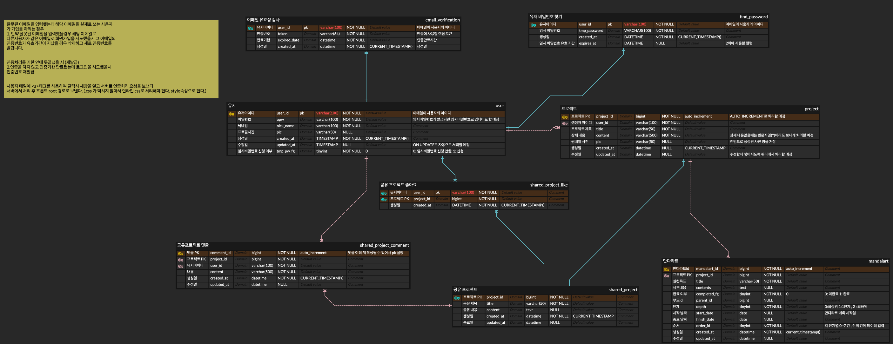
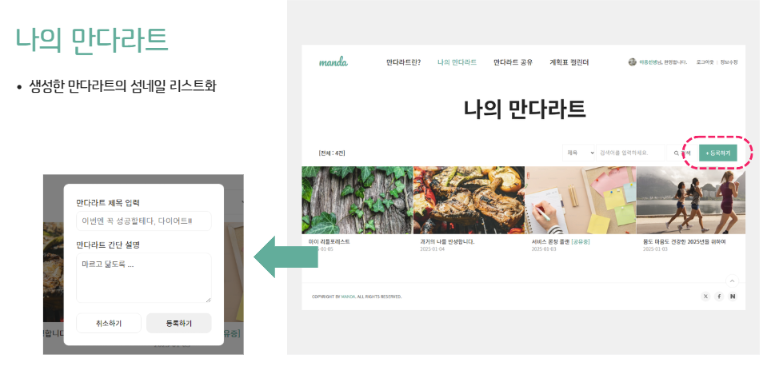
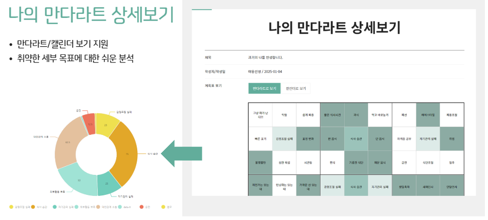
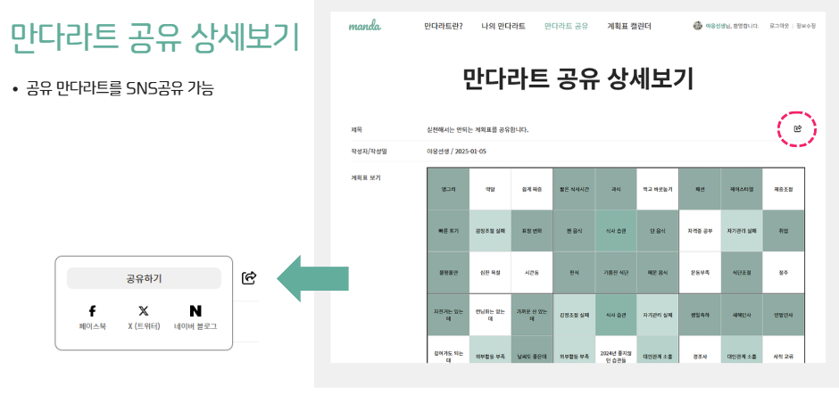
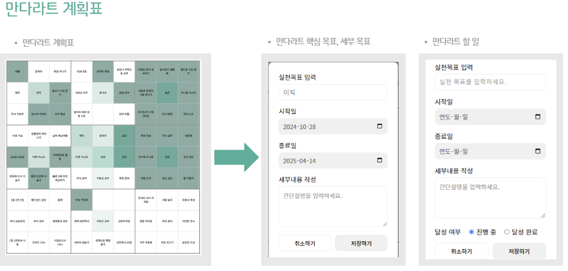

# 만다라트 웹

  

## 만다라트 웹 솔루션
> 그린 아트 컴퓨터 학원 1차 팀 프로젝트 만다라트 웹 솔루션  
> 만다라트(Mandal-Art)는 목표 설정과 아이디어 확장을 위한 사고 도구입니다. 3×3 격자 형태의 구조를 사용하여 중심 목표를 설정하고, 이를 달성하기 위한 세부 목표와 실행 방안을 체계적으로 도출할 수 있습니다.  
이 프로젝트는 만다라트 기법을 웹으로 구현하여, 사용자가 직관적으로 목표를 설정하고 관리할 수 있도록 제공합니다.  
> 개발기간: 2024.12.30 ~ 2025.01.08

## 개발 환경
- IntelliJ
- Postman
- GitHub

## 사용 기술
### 백엔드
#### 주요 프레임워크 / 라이브러리
- Java 11 openjdk
- SpringBoot 3.3.6
- Mybatis

#### Build tool
Gradle

### 기타 주요 라이브러리
- Lombok
- springopen-api(SWAGGER)

## E-R 다이어그램

## 주요 기능
#### 나의 만다라트 생성

> 나의 만다라트 목록을 만들고 관리할 수 있습니다.

#### 나의 만다라트 상세보기

> 내가 작성한 만다라트 계획을 조회하고 만다라트(3x3격자 무늬)로 표현하며
그래프를 통한 세부 목표에 대한 쉬운 분석이 가능합니다.

#### 만다라트 공유

> 내가 작성한 만다라트를 다른 서비스 이용자들과 공유할 수 있습니다.

#### 공유만다라트 SNS 공유

> 공유한 만다라트는 SNS로도 공유가 가능합니다.

#### 만다라트 작성

> 3X3 격자에 중심 목표와 핵심목료를 입력하고 일자를 입력합니다.

#### 임박한 목표 알림 기능

> 만다라트에서 선택한 일자가 임박했다면 서비스에서 알림을 전송합니다.

## 담당 파트(팀장 사공수기)
1. 요구사항 분석 및 프로토 타입 작성
2. 일정관리 및 작업 분배
3. 프로젝트 및 공유 프로젝트 CRUD
5. 임박한 일정 조회 R
6. CustomException 처리
7. GlobalExceptionHandler 처리(예외를 한곳에서 처리할 수 있도록)

## 사이트 접속 URL
* [112.222.157.157:5211](http://112.222.157.157:5211/)
  
> **사용자 테스트 ID, PW** 
> > **ID**: jumoney1012@gmail.com 
> > **PW**: qwer12#$

## 참고자료
* [1차 팀 프로젝트 대시보드](https://seed-hickory-06d.notion.site/1-17aedc5262e0808a88d3c313e65c5cbb)
* [1차 팀 프로젝트 발표자료](https://www.canva.com/design/DAGb-BkIDFQ/zFsEsUygb-Yvwanmdpemow/view?utm_content=DAGb-BkIDFQ&utm_campaign=designshare&utm_medium=link2&utm_source=uniquelinks&utlId=hb9932b6d4b) 

