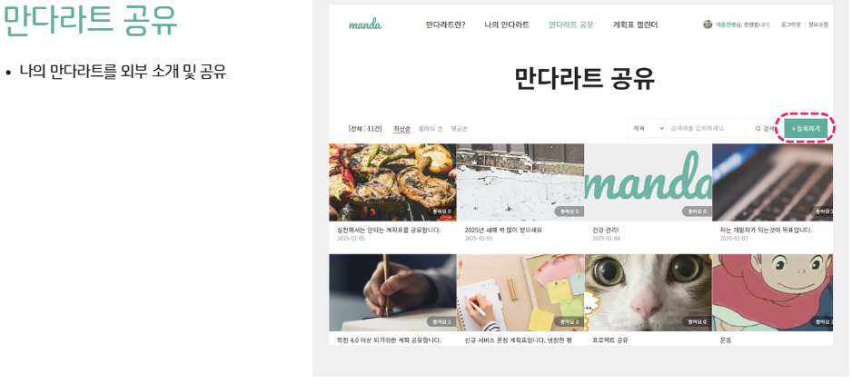

# 만다라트 웹

  

## 만다라트 웹 솔루션
> 그린 아트 컴퓨터 학원 1차 팀 프로젝트 만다라트 웹 솔루션  
> 만다라트(Mandal-Art)는 목표 설정과 아이디어 확장을 위한 사고 도구입니다. 3×3 격자 형태의 구조를 사용하여 중심 목표를 설정하고, 이를 달성하기 위한 세부 목표와 실행 방안을 체계적으로 도출할 수 있습니다.  
이 프로젝트는 만다라트 기법을 웹으로 구현하여, 사용자가 직관적으로 목표를 설정하고 관리할 수 있도록 제공합니다.  
> 개발기간: 2024.12.30 ~ 2025.01.08

## 개발 환경
- IntelliJ
- Postman
- GitHub

## 사용 기술
### 백엔드
#### 주요 프레임워크 / 라이브러리
- Java 11 openjdk
- SpringBoot 3.3.6
- Mybatis

#### Build tool
Gradle

### 기타 주요 라이브러리
- Lombok
- springopen-api(SWAGGER)

## E-R 다이어그램

## 주요 기능
### 가까운 식당 조회 & 평균식사시간 순 정렬

>카카오 지도 API를 사용해 현재 위치에 3KM 반경의 식당을 조회하고 평균 식사시간 순으로 조회가 가능합니다.

### 함께결재 기능

>회사동료와 주문금액을 분배해 한번에 결재할 수 있는 시스템을 제공합니다.

### 식당관리자 실시간 알림 기능

> 사용자 예약시 식당관리자 페이지에 소켓통신을 사용한 실시간 알림이 표시됩니다.

### 회사관리자 포인트 구매 토스페이먼트 결재 기능

> 토스페이먼트를 사용해 포인트 구매를 간편히 진행할 수 있습니다.

## 담당 파트(사공수기)
1. 실시간 알림을 위한 소켓통신 적용(SockJS & STOMP)
2. 사용자 이메일인증을 위한 SMTP서버 연동(Google SMTP 서버)
3. 포인트 구매를 위한 토스페이먼트 API 연동    
4. 도메인 및 HTTPS 적용
5. 스프링시큐리티 및 JWT 적용

## 사이트 접속 URL
* [112.222.157.157:5211](http://112.222.157.157:5211/)
  
> **사용자 테스트 ID, PW** 
> > **ID**: 00010009 
> > **PW**: qwer12#$

## 참고자료
* [1차 팀 프로젝트 대시보드](https://seed-hickory-06d.notion.site/1-17aedc5262e0808a88d3c313e65c5cbb)
* [1차 팀 프로젝트 발표자료](https://www.canva.com/design/DAGb-BkIDFQ/zFsEsUygb-Yvwanmdpemow/view?utm_content=DAGb-BkIDFQ&utm_campaign=designshare&utm_medium=link2&utm_source=uniquelinks&utlId=hb9932b6d4b) 

